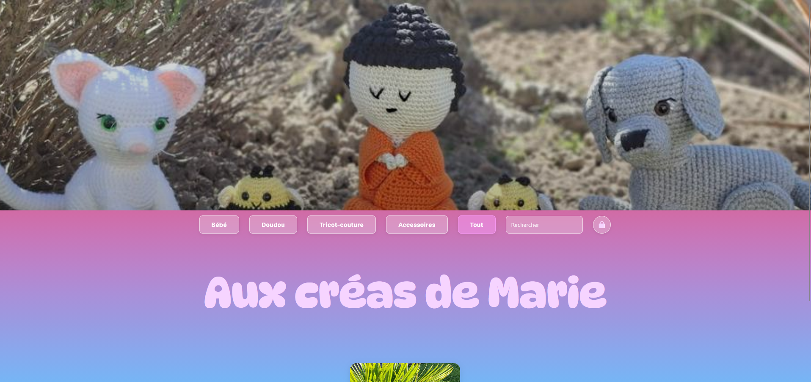
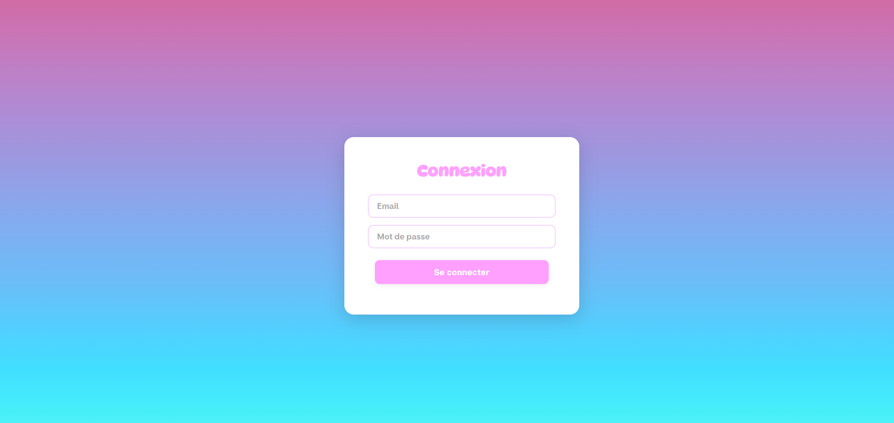

# 🧶 Aux créas de Marie

Site réalisé pour une amie afin de présenter et vendre ses créations artisanales faites main.

## ✨ Présentation

**Aux créas de Marie** a démarré comme un simple site vitrine, et évolue progressivement vers un véritable site e-commerce.

L'objectif est de proposer une boutique en ligne simple, chaleureuse et visuelle, permettant à Marie de gérer elle-même ses créations (ajout, modification, suppression) et à sa clientèle de les découvrir et, bientôt, de les commander.

Ce projet est réalisé bénévolement dans un cadre personnel, avec une attention particulière portée à la présentation des créations et à l'expérience de navigation.

## 📸 Aperçu





<!-- Captures d'écran à ajouter : interface admin, version mobile -->

## 🎨 Fonctionnalités

**Côté site public**
* 🏠 Page d'accueil présentant l'univers de la créatrice
* 🧶 Galerie de créations, chargée dynamiquement depuis la base de données
* 🔍 Recherche et filtre par catégorie
* 📱 Interface responsive (menu burger sur mobile)
* ✨ Design simple et chaleureux, avec effet de parallax

**Côté administration (réservé à Marie)**
* 🔐 Connexion sécurisée (sessions PHP, mots de passe hashés)
* ➕ Ajout d'une création (avec image, nom, description, prix, catégorie)
* ✏️ Modification d'une création existante
* 🗑️ Suppression d'une création

**À venir**
* 🎨 Demandes de personnalisation
* 💳 Paiement en ligne
* 📦 Suivi des commandes (API Okapi / Colissimo de La Poste)
* 📊 Statistiques de vente
* 🚚 Gestion de la livraison
* 📈 Google Analytics / Google Tag Manager

## 🛠️ Technologies utilisées

* **HTML5 / CSS3 / JavaScript** — structure, mise en forme responsive, interactions côté client
* **PHP 8.2** — logique serveur et API (authentification, gestion des créations)
* **MySQL 8** — base de données
* **Docker / Docker Compose** — environnement de développement (PHP + Apache, MySQL, phpMyAdmin)
* **Git / GitHub** — gestion et versionnement du projet

## 📁 Structure du projet

```text
Aux-cr-as-de-Marie/
│
├── Front/                       # Tout ce qui s'affiche dans le navigateur
│   ├── site.html                # Site public
│   ├── admin.html               # Interface d'administration
│   ├── login.html               # Page de connexion admin
│   ├── (les formulaires d'ajout / modification / suppression sont des modales dans admin.html)
│   ├── css/site.css             # Styles
│   ├── js/site.js               # Galerie, recherche, filtres, parallax, menu burger
│   ├── js/admin.js              # Admin : ajout, modification, suppression, déconnexion
│   ├── js/login.js              # Affiche le message d'erreur de connexion
│   ├── js/utils.js              # Outils partagés (escapeHtml : protège l'affichage contre le code caché)
│   └── media/                   # Images statiques du site (fond, logo...)
│
├── Back/                        # Serveur, API et base de données
│   ├── docker-compose.yml       # Définit les services : mysql, phpmyadmin, php
│   ├── Dockerfile               # Image PHP personnalisée (ajout de l'extension pdo_mysql)
│   ├── init.sql                 # Création des tables (exécuté au premier démarrage de MySQL)
│   ├── docs/
│   │   └── create_admin.txt     # Script ponctuel pour créer le premier compte admin
│   ├── api/                     # API PHP, appelée par le front via /api/...
│   │   ├── config.php           # Connexion à la base de données
│   │   ├── login.php / logout.php   # Connexion / déconnexion admin
│   │   ├── admin_check.php      # Vérifie qu'un admin est bien connecté (bloque sinon)
│   │   ├── session.php          # Répond si l'admin est connectée (utilisé par admin.js)
│   │   ├── start_session.php    # Démarre la session et déconnecte après 2 h d'inactivité
│   │   ├── cards.php            # Liste des créations (JSON)
│   │   └── add_card.php / edit_card.php / delete_card.php   # CRUD des créations
│   └── uploads/                 # Images des créations, ajoutées via l'admin
│
└── README.md
```

## 🚀 Installation

Le projet tourne via Docker. Prérequis : [Docker](https://www.docker.com/) installé.

```bash
git clone https://github.com/Alliiissonnee/Aux-cr-as-de-Marie.git
cd Aux-cr-as-de-Marie/Back
docker compose up -d --build
```

Docker sert le dossier `Front/` comme racine du site, avec `Back/api/` et `Back/uploads/` branchés dessus. Les tables sont créées automatiquement à partir de `Back/init.sql` au premier démarrage.

Le site est alors accessible sur [http://localhost:8000/site.html](http://localhost:8000/site.html), et phpMyAdmin sur [http://localhost:8082](http://localhost:8082) (identifiants MySQL dans `docker-compose.yml`).

Pour créer le premier compte admin, adapter l'email/mot de passe dans `Back/docs/create_admin.txt` puis exécuter son contenu (par exemple via un fichier PHP temporaire ou phpMyAdmin), avant de se connecter sur [http://localhost:8000/login.html](http://localhost:8000/login.html).

## 💡 Contexte du projet

Ce site est développé dans le cadre d'un **projet personnel**, à la demande d'une amie souhaitant vendre ses créations en ligne.

Ce projet me permet de travailler notamment sur :

* la conception d'une interface adaptée à un besoin réel ;
* le développement front-end (HTML, CSS, JavaScript) et back-end (PHP, MySQL) ;
* la mise en place d'une authentification et d'un espace d'administration ;
* la consommation d'une API JSON maison depuis le front (fetch, rendu dynamique) ;
* l'utilisation de Docker pour un environnement de développement reproductible ;
* l'intégration progressive de fonctionnalités e-commerce (paiement, livraison, suivi).
